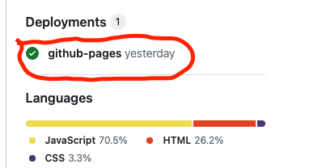

# TestYourCloudKnowledge.com

## Description
TestYourCloudKnowledge.com is a web application designed to help users assess their knowledge of cloud computing concepts and technologies. It offers a collection of quizzes covering various topics related to cloud computing, including but not limited to cloud service models, deployment models, security, and best practices.

## User Story
The target audience or user that can use this site are:
- As a cloud computing enthusiast, I want to test my knowledge of different cloud service models to understand their differences and use cases.
- As a student studying cloud computing, I want to practice quizzes on cloud security to prepare for certification exams.
- As an IT professional, I want to assess my understanding of cloud deployment models to make informed decisions for my organization's cloud strategy.

## Installation
To deploy TestYourCloudKnowledge.com locally, follow these steps:
1. Clone the repository:

        git clone https://github.com/TobeOsueke/TestYourCloudKnowledge.com.git

2. Navigate to the project directory:
        cd TestYourCloudKnowledge.com

3. Copy the full file name/path of index.html: 
        
        /Users/your_username/parent_folder/TestYourCloudKnowledge.com/index.html

4. Open your web browser and paste the file path you copied in previous step to view the application.

## Deployment
The site was deployed to GitHub pages. You can follow the below steps to deploy in your environment:
1. After you login to your GitHub account, navigate to the Repository - https://github.com/TobeOsueke/TestYourCloudKnowledge.com

2. Fork the Repository: On the top right corner of the repository page, you'll see a button labeled "Fork". Click on it. This will create a copy of the repository in your GitHub account.

3. Wait for Forking: GitHub will redirect you to your forked copy of the repository. Depending on the size of the repository, this process might take a few seconds. Once it's done, you'll see the repository under your GitHub username.

4. In the GitHub repository under your GitHub username, navigate to the Settings tab.

5. From the source section drop-down menu, select the Master/Prod Branch.
6. Once the master branch has been selected, the page will be automatically refreshed with a detailed ribbon display to indicate the successful deployment. 
7. Go back to the repository home page, at the button ri corner, you will see Deployment. click on github-pages and follow the on-screen instructions to view the deployed site.

## Usage
To use TestYourCloudKnowledge.com, 

- simply navigate to the website URL - https://tobeosueke.github.io/lifehacks/
- Click Register to begin and enter a username
- Select a service provider from the available options.
- Read the Test instructions and click the start test button below the page.
- Each quiz consists of multiple-choice questions related to cloud computing concepts. Users can select their answers and submit the quiz (within 15 minutes) to receive instant feedback on their performance.

## Contributing
We welcome contributions from the community! If you'd like to contribute to TestYourCloudKnowledge.com, please follow these guidelines:
- Fork the repository
- Create a new branch (`git checkout -b feature`)
- Make your changes
- Commit your changes (`git commit -am 'Add new feature'`)
- Push to the branch (`git push origin feature`)
- Create a new Pull Request

## Credits
TestYourCloudKnowledge.com was created by Tobe Osueke. We would like to acknowledge the following resources that were helpful:

### Image Source
- AWS.png  - https://www.linkedin.com/pulse/aws-cloud-practitioner-essentials-waqas-khurshid-gpmyf/
- azure-aws.jpeg - https://ecstech.com/ecs-insight/cloud/aws-and-azure-effective-tools-for-a-multi-cloud-solution/

### Code Source:
- Got the below code used in awsAzure.js from https://sentry.io/answers/how-to-get-values-from-urls-in-javascript/#:~:text=Getting%20URL%20Query%20Parameters%20in%20the%20Browser&text=The%20get()%20method%20returns,for%20a%20given%20query%20parameter.

        const searchParams = new URLSearchParams(window.location.search);
        console.log(searchParams.has('user')); // true
- Code Institues JavaScript Course was also helpful.
- In building the timer feature (countdownTimer function in awsAzure.js file), ChatGPT was used

## TESTING
The site was fully tested during the entire process of developemnt. Every features on each pages were tested. Below are list of test performed on each pages:

### Index.html Page
1. Image Responsiveness: All images were checked that they display well in different mobile device.
2. Checking Each Divs (parent and child) are well floated.
3. Link: Checked that all internal links open on same tab.
4. Footer: Checked that the footer is well positioned. 

### register.html Page
1. Image Responsiveness: Header image were checked that they display well in different mobile device.
2. Checked that each html elements are well positioned on different screen size (mobile, tab, laptop)
3. Link: Checked that all internal links open on same tab.
4. Register form: Checked that users are able to input name and the submit button sends the data for processing.

## FAQs
### How can I contribute a new quiz?
To contribute a new quiz, please follow these steps:
1. Create a new quiz file in the `src/quizzes` directory.
2. Define the questions, options, and correct answers in the quiz file.
3. Submit a pull request with your changes.

### How are quiz scores calculated?
Quiz scores are calculated based on the number of correct answers submitted by the user. Each correct answer contributes to the user's total score. Maximum score that a user can score is 15 since the total questions is 15

## Changelog
### Version 1.0.0 (2024-05-10)
- Initial release of TestYourCloudKnowledge.com
